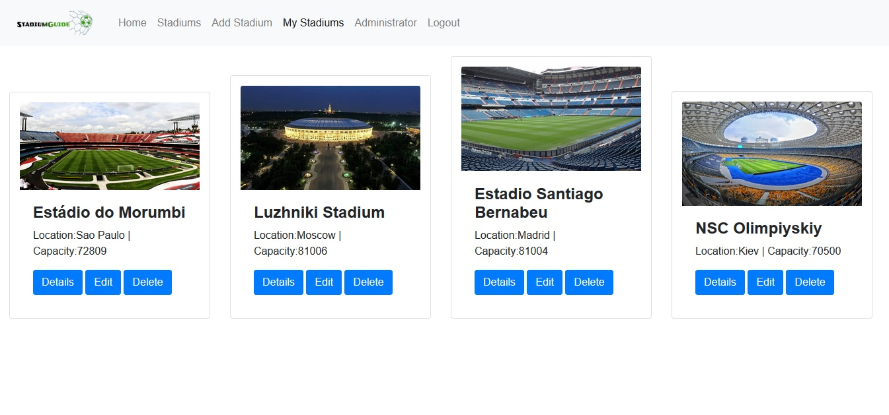

# Stadium

This web application using React framework with Node.js and Expresss.js back-end. It presents guide for stadiums which has information about stadiums all over the world their names, capacity, location, some interesting facts and direct metro line to the stadium if exist.

-	public part (accessible without authentication)
-	private part (available for registered users) 
-	administrative part (available for administrators only)


# Public Part

The public part is available for all users without authentication. The public part is start page, the user login and user registration forms, as well as the list with all created stadiums (Stadium) and short information about each of them. Unregistered users can�t see the details and post review about stadiums.

# Private Part (User Area)

Registered users has personal page (My Stadiums) with their own stadiums in the web application accessible after successful login. Each registered user can see details about all stadiums, post review and create new stadiums. Only created by himself stadiums can be modify and delete.

# Administration Part

System administrator has administrative access to the system and permissions to administer all major information objects in the application. Administrator can create, delete and update all stadium information, and create delete and edit user information. Administrator has personal page (Administrator) with information about all users, statistic about number of users and number of stadiums.

### Tech

Stadium uses a number of open source projects to work properly:

* React - declarative, efficient, and flexible JavaScript library
* Bootstrap - great UI boilerplate for modern web apps
* node.js - evented I/O for the backend
* Express - fast node.js network app 

### Installation

Stadium requires [Node.js](https://nodejs.org/)

Install the dependencies and devDependencies and start the server.

```sh
$ npm install
$ npm start - for client and server folders
```

License
----

MIT


**Enjoy!**
 